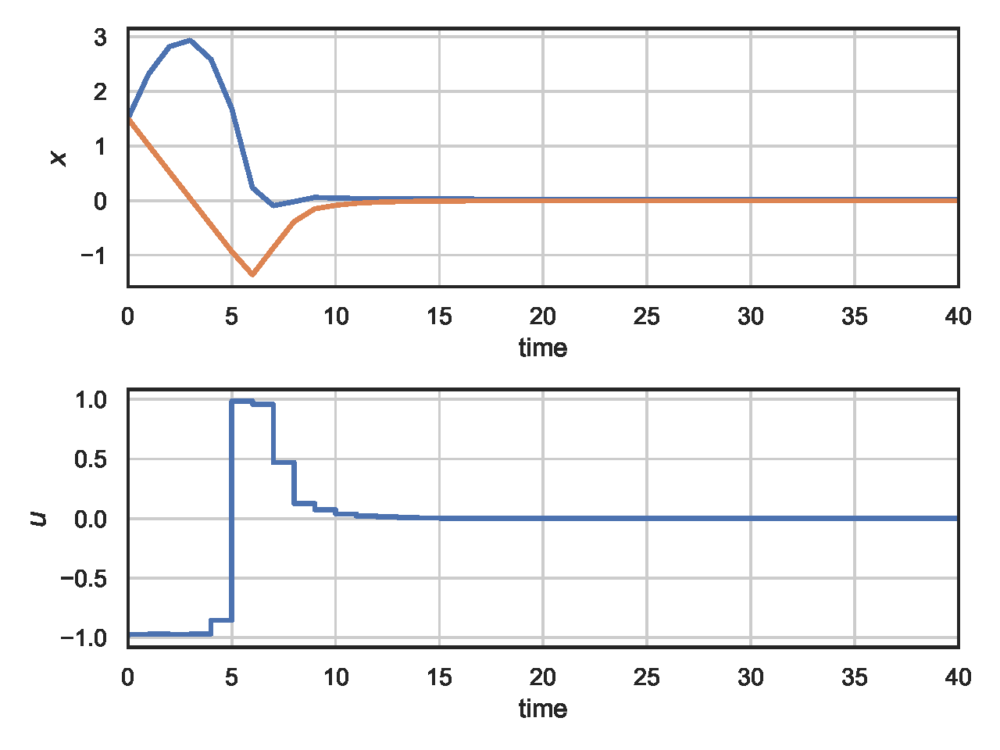

# NeuroMANCER
## Neural Modules with Adaptive Nonlinear Constraints and 	Efficient Regularizations

## [Complete Documentation](https://pnnl.github.io/neuromancer/)


## Setup

##### Clone and install neuromancer, linear maps, and emulator packages
```console
user@machine:~$ mkdir ecosystem; cd ecosystem
user@machine:~$ git clone https://github.com/pnnl/neuromancer
user@machine:~$ git clone https://github.com/pnnl/psl
user@machine:~$ git clone https://github.com/pnnl/slim

# Resulting file structure:
    ecosystem/
        neuromancer/
        psl/
        slim/
```

##### Create the environment via .yml (Linux)

```console
user@machine:~$ conda env create -f env.yml
(neuromancer) user@machine:~$ source activate neuromancer
```

##### If .yml env creation fails create the environment manually

```console
user@machine:~$ conda config --add channels conda-forge pytorch
user@machine:~$ conda create -n neuromancer python=3.7
user@machine:~$ source activate neuromancer
(neuromancer) user@machine:~$ conda install pytorch torchvision -c pytorch
(neuromancer) user@machine:~$ conda install scipy pandas matplotlib control pyts numba scikit-learn mlflow dill
(neuromancer) user@machine:~$ conda install -c powerai gym
```

##### install neuromancer ecosystem 

```console
(neuromancer) user@machine:~$ cd psl
(neuromancer) user@machine:~$ python setup.py develop
(neuromancer) user@machine:~$ cd ../slim
(neuromancer) user@machine:~$ python setup.py develop
(neuromancer) user@machine:~$ cd ../neuromancer
(neuromancer) user@machine:~$ python setup.py develop
```

### Differentiable Predictive Control 

TODO: add arxiv link

  
*Conceptual methodology.*


  
*Structural equivalence of DPC architecture with MPC constraints.*

  
*Closed-loop trajectories of learned constrained neural control policy using DPC.*


  
*Learned DPC policy.*

  
*Computed explicit MPC policy.*


#### Run experiments

Train DPC using Neuromancer:  
[neuromancer_dpc](train_double_integrator/double_integrator_DPC.py)  
Run benchmark explicit MPC in Matlab using Yalmip:  
[matlab_empc](train_double_integrator/double_integrator_eMPC.m)  

#### Cite as

TODO: add citation
